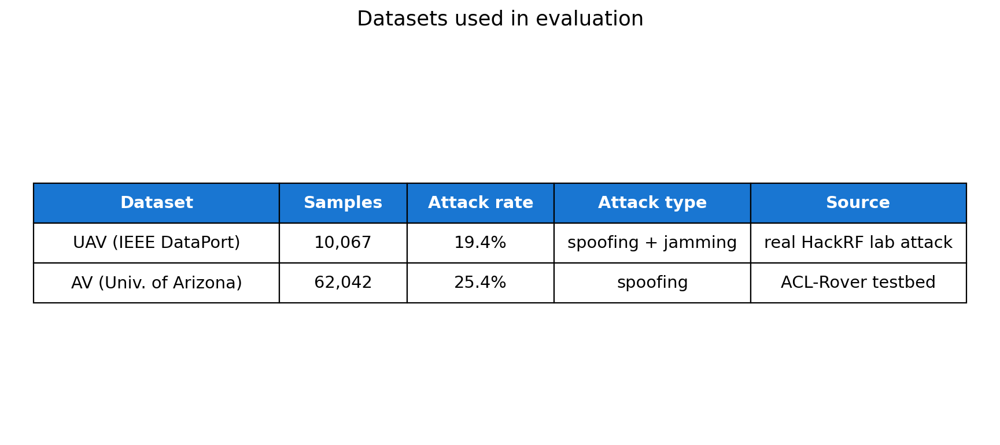
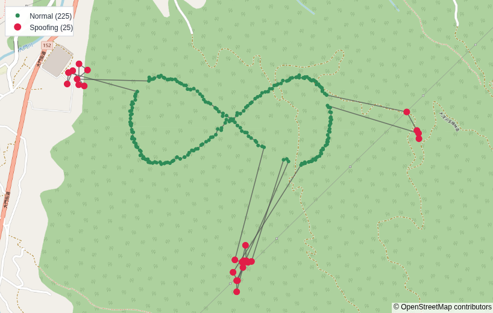
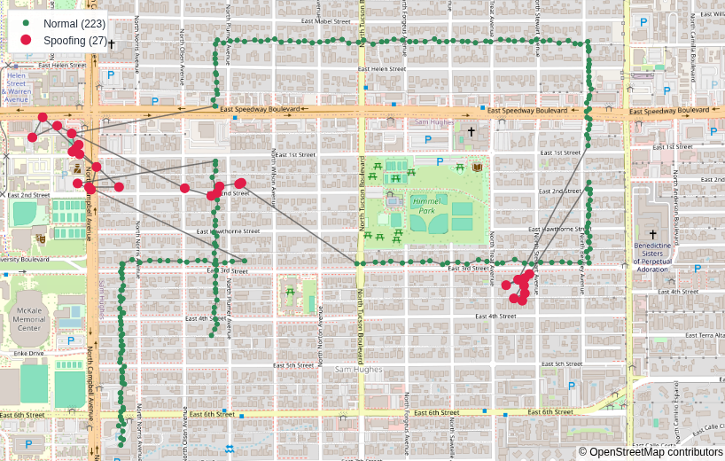
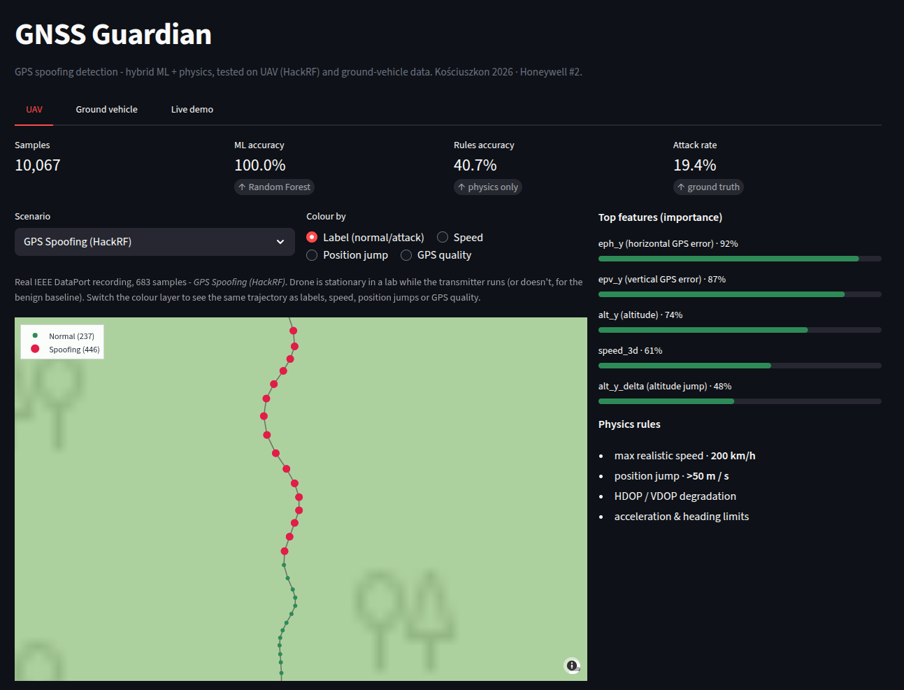
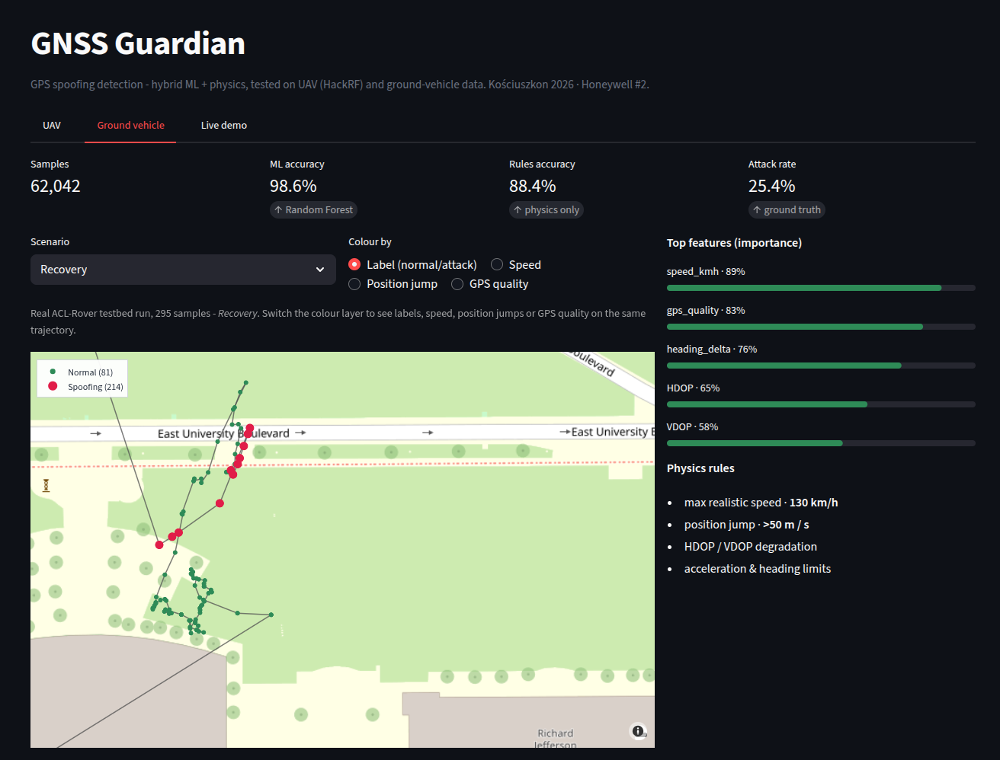
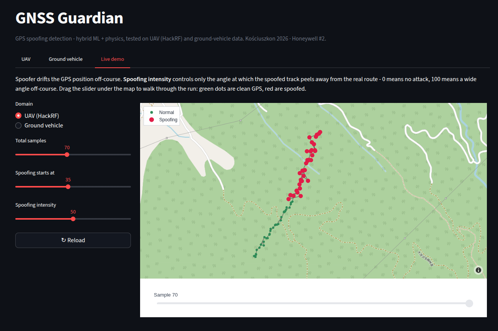
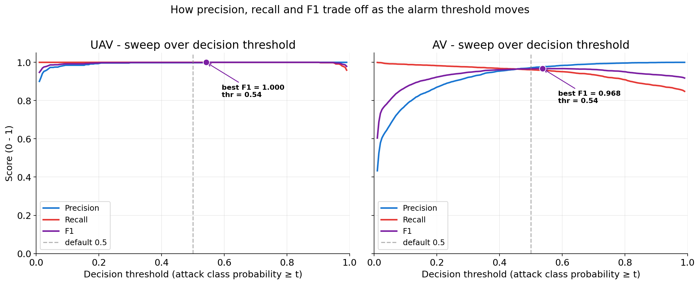
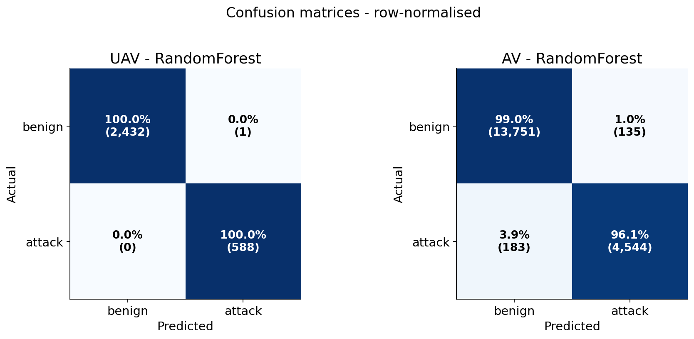

# GNSS Guardian

Hybrid ML + physics detector for GPS spoofing. Tested cross-domain on a UAV (HackRF lab) and a ground vehicle (Univ. of Arizona testbed). Built for Hackathon Kościuszkon 2026, Honeywell #2.



## Dashboard

Same dashboard, two modes. Synthetic scenarios on top to show the spoofing pattern cleanly, real recordings underneath to prove the pipeline runs on actual data. Green points are clean, red points are flagged as spoofed.

Synthetic illustrative scenarios:

| Drone | Ground vehicle |
|---|---|
|  |  |

Real recordings from the source datasets:

| UAV (HackRF lab) | Ground vehicle (Tucson, AZ) |
|---|---|
|  |  |

Live animation of an attack unfolding sample by sample:



## Numbers (held-out test set)

| Dataset | Samples | Attack rate | Random Forest | Physics rules |
|---|---:|---:|---:|---:|
| UAV (HackRF) | 10,067 | 19.4% | **100.0%** | 40.7% |
| Ground vehicle | 62,042 | 25.4% | **98.6%** | 88.4% |

Threshold matters. The sweep below shows how detection rate and false-alarm rate trade off as the cutoff moves:



## Why it works

Spoofing distorts the GPS quality channel before it distorts the position. Both datasets show the same fingerprint: HDOP, VDOP and `eph` jump several times the benign baseline.

## Run it

```bash
git clone https://github.com/<user>/gnss-guardian.git
cd gnss-guardian
pip install -r requirements.txt
streamlit run dashboard.py
```

Notebooks (full pipeline + EDA + evaluation):

```bash
jupyter notebook notebooks/01_UAV_Analysis.ipynb
jupyter notebook notebooks/02_AV_Analysis.ipynb
```

## How

```python
risk = 0.7 * ml_proba + 0.3 * rule_score
alert = risk > 0.5
```

* **Random Forest** (n_estimators=100, max_depth=12, min_samples_leaf=5, class_weight='balanced'). XGBoost tested, dropped (RF simpler to justify, accuracy within margin).
* **Physics rules**: max realistic speed, max position jump per second, HDOP/VDOP threshold.
* **Hybrid blend** keeps both numbers high regardless of which signal dominates a given domain.

Confusion matrices on the test split:



## Top features

* **UAV**: `eph_y`, `epv_y`, `alt_y`, `speed_3d`
* **AV**: `speed_kmh`, `gps_quality`, `heading_delta`

## Datasets

* **UAV HackRF**, IEEE DataPort, [Live GPS Spoofing & Jamming](https://ieee-dataport.org/). Real HackRF attacks on a stationary drone in a controlled lab.
* **AV-GPS-Dataset**, University of Arizona, ACL-Rover testbed. Real GPS spoofing on an autonomous vehicle, 3 attack scenarios (static spoof, smooth drift, recovery).

Both datasets ship with ground-truth labels and are open access. Files are gitignored, see source links above.

## Stack

Python 3.11, pandas, numpy, scikit-learn, Streamlit, Plotly Scattermapbox + OpenStreetMap tiles. One file dashboard, one command to run.

## Limits

Not validated on a real GNSS receiver in the field. Doesn't cover attack types absent from these datasets (replay, meaconing, smooth takeover). Only fakes position, not GNSS time, which is a separate problem with its own features and own model.
